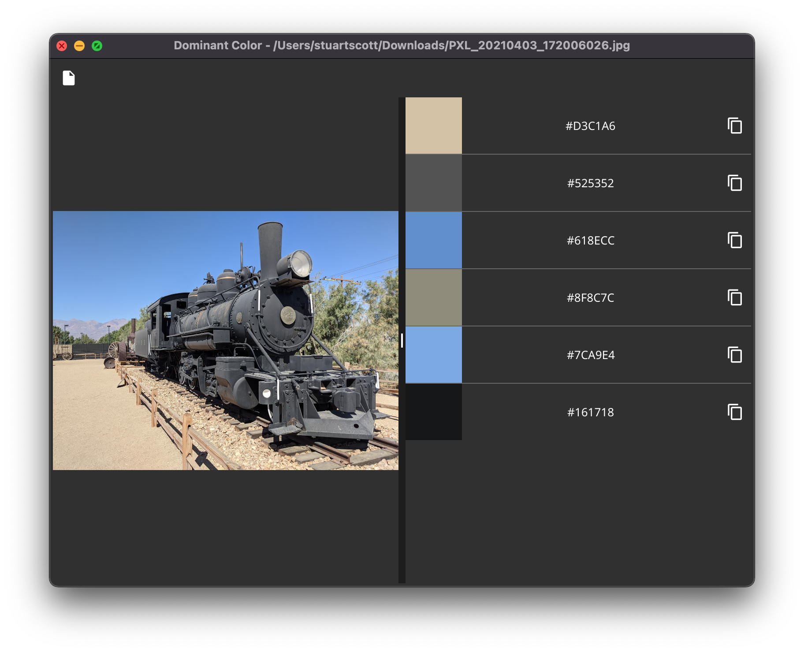

dominantcolor
=============

Display the dominant colors of an image - https://convey.earth/conversation?id=48.



Built with [Fyne](https://fyne.io), and [dominantcolor](https://github.com/cenkalti/dominantcolor).

### Usage

```sh
go get -u github.com/stuartmscott/dominantcolor
```

```sh
dominantcolor
```
or
```sh
dominantcolor /path/to/image.png
```
